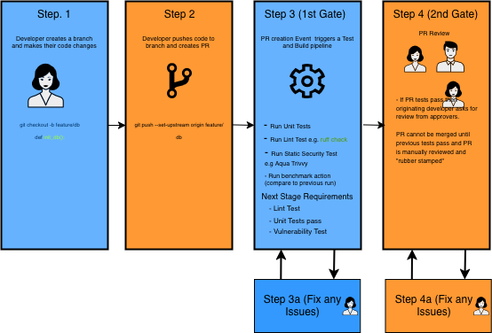
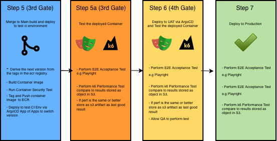

# Demonstration Pipeline Test And Deploy
This repository contains a simple electric car Lookup API. The app is largely irrelevant as it just used to illustrate the stages used to test and deploy code via a GitHub Actions pipeline.

This workflows expects users to merge into main and have the pipeline test and deploy from the initial branch and PR creation through to the production deploy.  This will use a Trunk based workflow rather than GitFlow.

To allow for this to work several gates are needed:

- PR testing. Initial testing for code quality, unit testing and static security analysis.
- Manual PR review.
- Merge and deployment to CI Test Environment for E2E Acceptance.

# Architecture

## Core Infra
- AWS EKS Kubernetes Container Orchestration
- Traefik Network Ingress + AWS NLB
- Microservice Architecture
- RDS PostGres

## Supporting Infra
- Doppler Secrets Manager for Kubernetes Secrets.
- Reloader for restarting pods when secrets in change in Doppler operator.

# Methodology
## Environments
CI/TEST used for Deploying code during the pipelines. This is where the end to end acceptance tests are run on.

UAT used to be deployed to for user and QA testing,

PROD the final production environment that serves client traffic.

## Tooling
Git and GitHub + Actions ,
ArgoCD for Deployment

## Step 1.
Developer will checkout the repo on their local machine.  Then create a branch from main.  They will add the changes/fixes to this branch via the the add/commit cycle.  Then push this branch to the git remote (e.g. GitHub). They may also make changes to the kubernetes manifest for the application by updating the HELM Chart.

_Justification_
This is a reasonable and largely standard Git workflow.

## Step 2.
Developer will create a pull request, requesting that their branch will be merged into MAIN branch. This will trigger a Github Action that is set to listen for PR request events.

## Step 3.
This GitHub Action will then perform code lint testing, both security and syntax, and it will run the developer supplied unit tests.

This is the first gate.  If the any of the checks and steps fail then this will prevent the PR being merged.  Ideally these PR checks should be passed before requesting a PR review out of courtesy for the reviewer.

## Step 4.
Request a PR review from the appropriate team members who have the permissions to do it.

## Step 5.
- Derive latest container image from ECR Registry tags.
- Create new semantic version.
- Build Container Image.
- Run a security scan  for the just created container image.
- Package up a new helm version of the application chart using new version of container image.
- Update ArgoCD App of App definition for this application use the new Helm chart on the CI TEST Environment.

